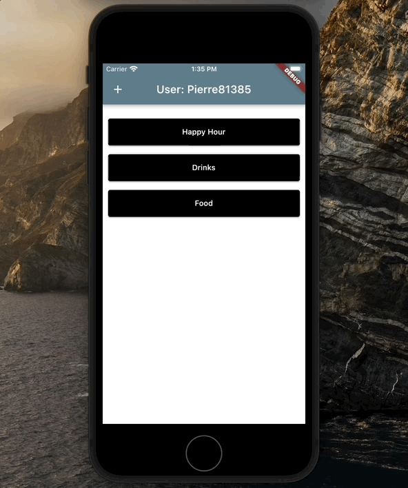
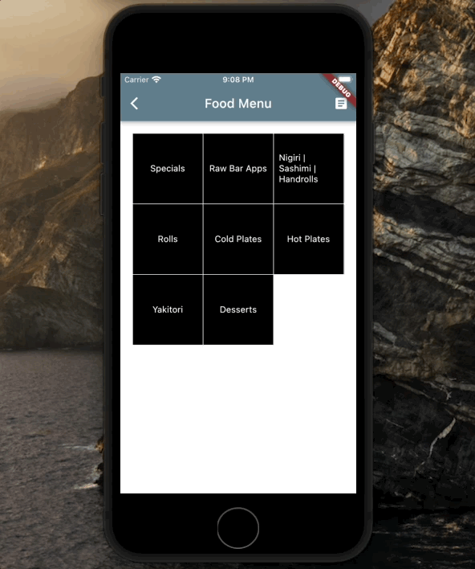

# app_playground

A new Flutter project. This is an app built for to purpose of being a testing ground for things I'd like to learn. Currently it takes the form of a POS ordering system, like a server or bartender might use to enter in orders for a table via their mobile device.

- Firebase Auth handles signup/login/user information.
- Firestore provides the database for storing menu items, and order information.

# Screenshot

Login with email is done with Firebase Auth.

Grid view menu items are generated by a menu class that matches lists of submenus with the menu selected on the main page (drinks => cocktails or beer, etc). Each submenu then generates a list of items pulled from the database according to the name of the submenu.

Menu items now have + or - quantity buttons. Ordering an item is done with a long press after selecting a quantity. Items ordered are added to the ticket which is viewable from the "ticket" icon on the right side of the app bar. When the order is ready, press ORDER to change the status from "pending" to "sent" on the order items.

# Overview

Currently this is a basic signup/login app using Firebase Auth.
